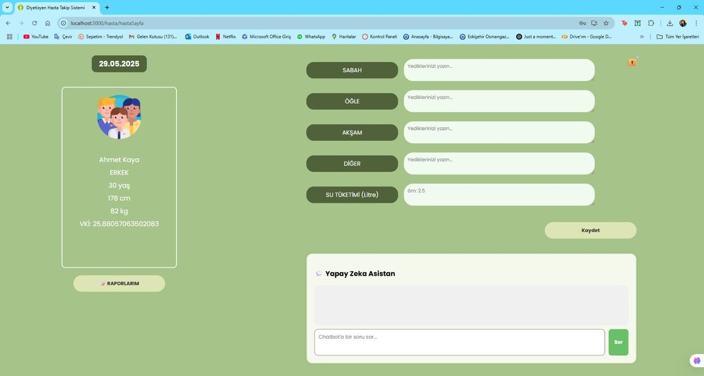
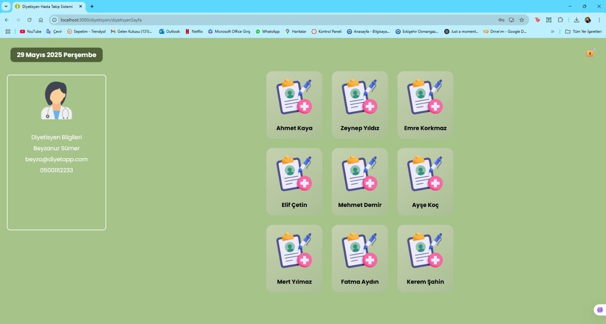
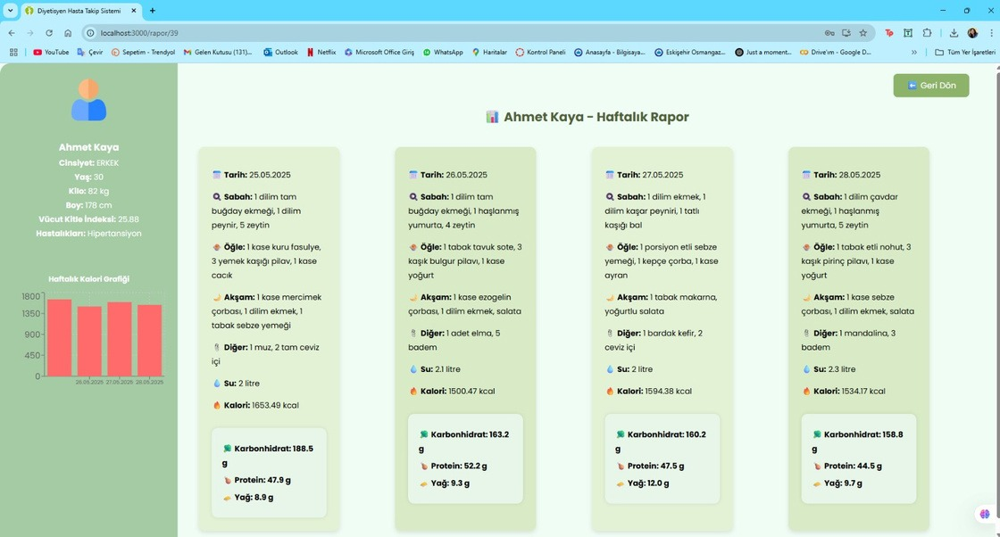

# 🥗 Diyetisyen-Hasta Takip Sistemi

Bu proje, diyetisyenler ile hastalar arasında etkileşimi dijitalleştirerek takip sürecini kolaylaştırmayı amaçlayan bir web uygulamasıdır. Kullanıcılar günlük olarak öğün, su tüketimi ve fiziksel aktivite bilgilerini girerken; diyetisyenler bu verileri anlık olarak takip edebilir ve değerlendirme yapabilir.

## 🚀 Özellikler

- 🧠 Yapay Zeka Destekli Chatbot (Gemini ile)
- 🔢 Otomatik Kalori Hesaplama (Nutritionix API + Google Translate API ile)
- 📊 Haftalık Raporlama Sistemi
- 👨‍⚕️ Diyetisyen ve Hasta Panelleri
- 🔐 JWT ile Kimlik Doğrulama
- ☁️ React.js + Spring Boot + PostgreSQL teknolojileri

## 🖼️ Ekran Görüntüleri

### ✅ Hasta Paneli

### 👩‍⚕️ Diyetisyen Paneli

### 📈 Haftalık Rapor Ekranı

## 🛠️ Kullanılan Teknolojiler
- **IDE :** IntelliJ IDEA
- **Frontend:** React.js
- **Backend:** Java Spring Boot
- **Veritabanı:** PostgreSQL
- **API:** Nutritionix, Google Translate
- **Diğer:** JWT, Axios, Recharts

## 📧 Geliştiriciler

- Cevahir Şahin – [`@cevahirsahin`](https://github.com/cevahirsahin)
- Beyza Süner - [`@beyzasuner`](https://github.com/beyzasuner)
- Senanur Öztürk

> Bu sistem, mezuniyet projesi kapsamında geliştirilmiştir.
